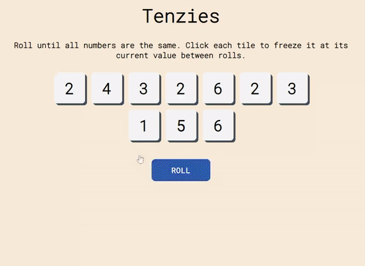

# Tenzies-Game

Capstone project from scrimba's [react course](https://scrimba.com/learn/learnreact)

This Project is hosted on Netlify. View the live site [here](https://tenzies-by-scott.netlify.app/).



# About

Inspired by the dice game, **TENZI®** - a simple yet competitive game where the first player who rolls all 10 on the same number and yells “**TENZI**,” wins.

# How to play the game

Roll all of the tiles at once and identify the number you want to achieve for all the tile. Then re-roll all those that do not match your number. You have to continue doing this until all the tiles show the number.

# Local Development

1. To clone this repository, type in your terminal (or copy)

   ```
   git clone https://github.com/scott-gianan/tenzies-game.git
   ```

2. Change to the tenzies-game directory

   ```
   cd tenzies-game
   ```

3. Install the necessary dependencies

   ```
   npm install
   ```

4. Run this repository locally

   ```
   npm run preview
   ```

5. Head on to your browser address bar and type (or copy the link):

   ```
   http://localhost:8080/
   ```

---
